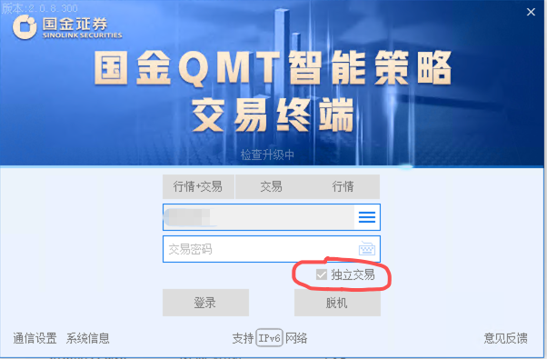
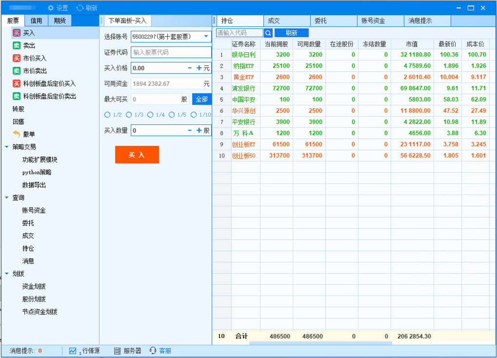
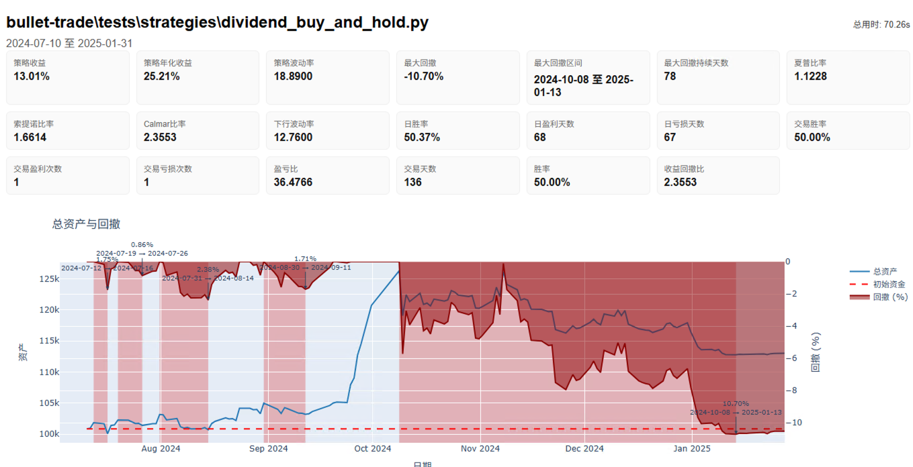

# 方案 A：独立运行

[返回新手入门总览](beginner-guide.md)

这一条路的意思是：

- 策略主体在你自己的机器或服务器运行
- BulletTrade 负责调度、取数、计算信号和下单
- QMT / MiniQMT 与策略放在同一台 Windows 机器上运行

## 适合谁

优先考虑下面这些：

- 均线、动量、成交额过滤、ETF 轮动、网格、择时
- 以量价数据为主的日频或分钟频策略
- 主要依赖通用聚宽风格 API，而不是平台侧研究环境
- 你愿意自己掌控日志、部署和运行状态

## 第一步：统一准备

### 1. 先理解机器角色

在这套方案里，常见角色只有 2 个：

- BulletTrade：负责本地策略执行
- QMT / MiniQMT：真正连券商执行下单

最关键的一点是：

- **QMT / MiniQMT 和 BulletTrade 应该放在同一台 Windows 机器上**

### 2. 建议的基础准备

- 已按 [环境准备：先安装 Python，再创建虚拟环境](python-setup.md) 完成 Python 安装
- 已安装并登录的 QMT，并且该环境支持 MiniQMT
- 一台可以运行 QMT / MiniQMT 的 Windows 机器

这里有两个关键要求：

- 后面的本地取数和实盘链路，默认都要能访问 `userdata_mini`
- 登录时请使用 **独立交易** 方式启动 QMT

可以参考下面这两张图：
登录要选择独立交易！




### 3. 先完成共享环境准备文档

如果你现在还没有装 Python，或者命令行里还不能正常执行：

- `python --version`
- `pip --version`

请先完成这篇：

- [环境准备：先安装 Python，再创建虚拟环境](python-setup.md)

做完以后，再继续本页后面的步骤。

## 第二步：先跑一个最简单的回测

不建议第一枪就直接拿复杂策略上实盘。  
先确认 Python、BulletTrade、MiniQMT 数据和最小策略链路都没问题。

如果你还不知道 `.env` 是什么，或者不知道怎么在 Windows 里创建这个文件，先看：

- [什么是 `.env` 文件，怎么创建](python-setup.md#env-file)

下面这个代码块不是命令行命令，而是要写进 `.env` 文件里的内容。

先准备一个最小 `.env`：

```env
DEFAULT_DATA_PROVIDER=qmt
QMT_DATA_PATH=C:\QMT\userdata_mini
QMT_ACCOUNT_ID=123456
```

再新建一个最简单的策略文件，例如 `my_first_strategy.py`：

```python
from bullet_trade.core.api import *


def initialize(context):
    set_benchmark('000300.XSHG')
    g.stock = '510300.XSHG'
    g.has_bought = False
    run_daily(market_open, time='open')


def market_open(context):
    if not g.has_bought:
        order_value(g.stock, context.portfolio.available_cash)
        g.has_bought = True
        log.info(f"买入 {g.stock}，金额={context.portfolio.available_cash:.2f}")
```

运行：

```bash
bullet-trade backtest my_first_strategy.py \
  --start 2024-01-01 \
  --end 2024-06-01 \
  --benchmark 000300.XSHG \
  --output backtest_results/first
```



## 第三步：最简单的部署方式，BulletTrade 和 QMT 在同一台 Windows 机器

这是最建议新手先走通的方式。

下面这个代码块同样是写进 `.env` 文件里的内容，不是直接输入到命令行的命令。

最小 `.env`：

```env
DEFAULT_DATA_PROVIDER=qmt
DEFAULT_BROKER=qmt
QMT_DATA_PATH=C:\QMT\userdata_mini
QMT_ACCOUNT_ID=123456
```

运行：

```bash
bullet-trade live my_first_strategy.py --broker qmt
```

## 第四步：先跑通最小实盘链路，再替换成复杂策略

建议顺序：

1. 先用最小策略跑回测
2. 再用最小策略跑 `live`
3. 确认日志里能看到策略启动、调度触发、账户信息和下单结果
4. 最后再替换成复杂策略

下面这种日志，才说明本地直跑链路基本正常：


## 常见坑

### 1. 不要第一步就直接拿复杂策略做验证

复杂策略没信号时，你很难第一时间判断是：

- 环境没通
- 选股没通
- 数据没通
- 函数不兼容
- 还是单纯当天没有信号

### 2. `QMT_DATA_PATH` 要写正确

QMT 数据目录要写到 `.env` 的 `QMT_DATA_PATH`。

### 3. 本地运行没有行情或数据不对

优先排查：

- `DEFAULT_DATA_PROVIDER` 是否设置正确
- `QMT_DATA_PATH` 是否指向正确的 `userdata_mini`
- QMT / MiniQMT 本地是否已经准备好对应数据
- 代码格式是否统一为 `.XSHG/.XSHE`

### 4. 代码能回测，实盘却不工作

常见原因：

- 回测和实盘使用的本地数据目录、数据下载范围或频率不一致
- 回测是日频，实盘是分钟频
- 回测只验证了策略逻辑，没有验证真实下单链路
- 回测里有信号，实盘当日未必有信号

## 正式上线前检查清单

- 你已经确认本策略适合方案 A
- 你已经跑通最小回测
- 你已经跑通最小实盘链路
- 你已经确认 QMT 登录正常
- 你已经确认 `QMT_DATA_PATH` 正确
- 你已经先用最小资金或模拟环境验证
- 你已经能在日志里区分“没有信号”和“有信号但下单失败”

