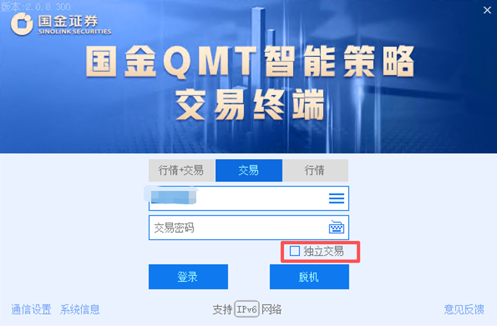
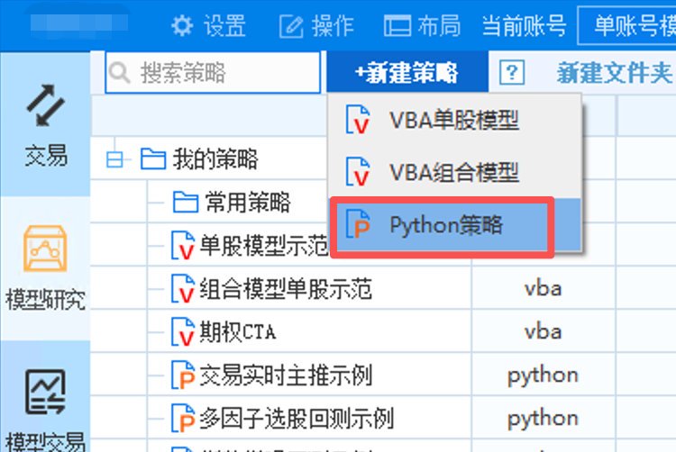
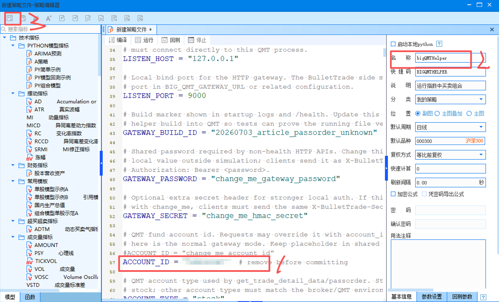
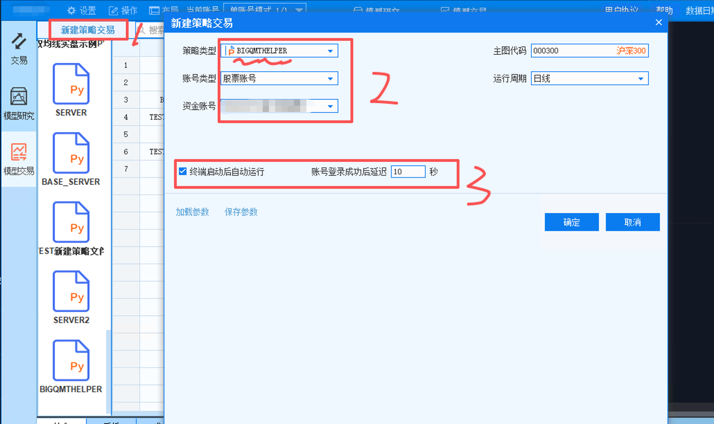
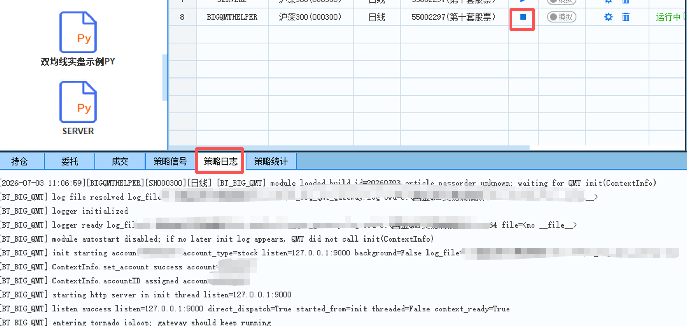

# 大 QMT 服务向导

这页说明如何在大 QMT 里运行 BulletTrade helper，并启动兼容原 `qmt-remote` 的 `bullet-trade server`。

适用场景：券商不再提供 MiniQMT，或者 MiniQMT 不能继续作为数据和交易网关时，用大 QMT 的策略运行环境承接行情、账户、持仓、委托、成交和下单撤单能力。

如果你的券商仍然提供 MiniQMT/xtquant，并且可以正常访问 `userdata_mini`，优先看 [QMT server（MiniQMT 后端）](qmt-server.md)。本页只讲大 QMT helper 后端。

## 小 QMT 和大 QMT 的关系

从底层能力看，小 QMT 和大 QMT 是两种不同的数据/交易后端：

| 维度 | 小 QMT / MiniQMT | 大 QMT |
|------|------------------|--------|
| 本地直连数据源 | `DEFAULT_DATA_PROVIDER=qmt` | 不提供本地直连 provider |
| 本地直连交易通道 | `DEFAULT_BROKER=qmt` | 不直接作为 broker 使用 |
| server 后端 | `--server-type qmt` | `--server-type big_qmt` |
| 依赖 | `xtquant` / `userdata_mini` | 大 QMT 策略环境里的 `ContextInfo` 和内置函数 |
| 客户端访问 | 可直连 `qmt`，也可通过 `qmt-remote` | 通过 `qmt-remote` |

所以文档里看到的 `qmt-remote` 不是说小 QMT 和大 QMT 是同一个数据源，而是说它们都可以被包装成同一套远程协议。上层策略为了兼容，统一连 `58620` 的 `qmt-remote`；底层 server 再决定实际使用 MiniQMT 后端还是大 QMT 后端。

大 QMT 只替换底层 QMT 网关，不限定上层策略运行方式。BulletTrade 原来的两种使用路线都支持：

- 方案 A：策略直接用 `bullet-trade live` 独立运行，连接 `qmt-remote`。
- 方案 B：策略在聚宽模拟盘等远程环境运行，通过 BulletTrade helper 调用本地 `qmt-remote` 服务。

## 1. 架构先看清

大 QMT 方案分两层：

```text
大 QMT 策略进程
  运行 helpers/big_qmt_gateway_strategy_sample.py
  监听本机 127.0.0.1:9000
        |
        v
bullet-trade server --server-type big_qmt
  连接大 QMT helper
  对外监听 58620
        |
        v
策略 / AIStocks V2 / bullet-trade live
  仍然使用 qmt-remote 连接 58620
```

注意：

- `9000` 是大 QMT helper 的本机 HTTP 端口，只给同一台机器上的 `bullet-trade server` 使用。
- `58620` 才是 BulletTrade 对外提供的 qmt server 端口。
- 上层策略仍然配置 `qmt-remote`，不需要直接知道底层是 MiniQMT 还是大 QMT。
- 方案 A 的本地 live 和方案 B 的聚宽远程调用都走同一个 `58620` qmt server。

## 2. 登录大 QMT

先正常登录大 QMT 交易端。



要点：

- 确认登录的是要提供数据和交易能力的资金账号。
- 登录后保持大 QMT 运行，helper 服务依赖这个进程。

## 3. 新建 Python 策略

在大 QMT 左侧策略区新建 Python 策略。



建议策略名称使用容易识别的名字，例如：

```text
BIGQMTHELPER
```

## 4. 粘贴 helper 并修改顶部参数

把仓库里的 helper 文件内容复制到大 QMT 策略编辑器：

```text
helpers/big_qmt_gateway_strategy_sample.py
```

保存前先检查顶部参数。
由于我们是监听的本机端口，实际上也没有什么太多的安全隐患，但是记得把 ACCOUNT_ID 改了。


常用参数：

| 参数 | 说明 | 建议 |
|------|------|------|
| `LISTEN_HOST` | 大 QMT helper 监听地址 | 默认 `127.0.0.1` |
| `LISTEN_PORT` | 大 QMT helper 监听端口 | 默认 `9000` |
| `GATEWAY_BUILD_ID` | 启动日志和 `/health` 里的版本标识 | 每次升级 helper 后更新 |
| `GATEWAY_PASSWORD` | BulletTrade 访问 helper 的密码 | 必须改成私有值，并和 server 侧一致 |
| `GATEWAY_SECRET` | 可选增强认证密钥 | 可先保留默认，正式环境建议改 |
| `ACCOUNT_ID` | QMT 资金账号 | 改成当前大 QMT 登录账号 |
| `ACCOUNT_TYPE` | 账户类型 | 股票账户用 `stock` |
| `ENABLE_TRADING` | 是否允许下单 | 仿真测试可设 `True`，只读验证设 `False` |
| `ENABLE_CANCEL_ORDER` | 是否允许按订单号撤单 | 需要撤单时设 `True` |
| `RUN_HTTP_IN_BACKGROUND_THREAD` | 是否后台线程运行 HTTP | 默认按 helper 注释使用，不要随意改 |
| `AUTO_START_HTTP_ON_MODULE_LOAD` | 模块加载时是否自启动 HTTP | 正式运行通常保持 `False` |
| `LOG_DIR` / `LOG_FILE_NAME` | helper 日志位置 | 默认即可，排查时看日志 |

特别注意：

- 文件头保持 `#encoding:gbk`。
- 复制到开源仓库或提交前，不要保留真实资金账号、密码和密钥。
- 大 QMT 内置 Python 较老，helper 已按大 QMT 白名单库控制依赖，不要额外加第三方库。

## 5. 新建策略交易运行项

回到模型交易区，新建策略交易，选择刚才保存的 Python 策略。



建议配置：

- 策略类型：选择刚才的 helper 策略。
- 账号类型：股票账户。
- 资金账号：选择当前要提供服务的 QMT 资金账号。
- 主图代码：可以用 `000300`。
- 运行周期：日线即可。
- 勾选“终端启动后自动运行”。

不要勾选“启动本地 Python”。如果勾选后大 QMT 只加载模块，不调用 `init(ContextInfo)`，helper 可能不会真正拿到 QMT 上下文。

## 6. 启动 helper 服务

启动刚才创建的策略交易运行项，然后查看“策略日志”。



正常启动时应看到类似日志：

```text
[BT_BIG_QMT] init starting account=...
[BT_BIG_QMT] ContextInfo.set_account success account=...
[BT_BIG_QMT] listen success listen=127.0.0.1:9000
[BT_BIG_QMT] entering tornado ioloop; gateway should keep running
```

如果只看到 `module loaded` 后策略结束，通常说明这个运行方式没有调用 `init(ContextInfo)`，优先检查是否勾选了“启动本地 Python”，以及是否是从策略交易运行项启动。

## 7. 启动 bullet-trade server

大 QMT helper 启动后，在同一台 Windows 机器上启动 `bullet-trade server`。

示例 `.env.bigqmt`：

```env
QMT_SERVER_TOKEN=change_me_server_token

BIG_QMT_GATEWAY_URL=http://127.0.0.1:9000
BIG_QMT_GATEWAY_PASSWORD=change_me_gateway_password
BIG_QMT_GATEWAY_TIMEOUT_SECONDS=30

BIG_QMT_ENABLE_TRADING=true
BIG_QMT_ENABLE_CANCEL_ORDER=true
```

启动命令：

```bash
bullet-trade --env-file .env.bigqmt server --server-type big_qmt --listen 0.0.0.0 --port 58620 --enable-data --enable-broker
```

说明：

- `--server-type big_qmt` 表示后端连接大 QMT helper。
- `BIG_QMT_GATEWAY_URL` 指向大 QMT helper 的 `9000` 端口。
- `QMT_SERVER_TOKEN` 是上层策略连接 `58620` 时使用的 token。
- `BIG_QMT_GATEWAY_PASSWORD` 必须和 helper 顶部的 `GATEWAY_PASSWORD` 一致。
- `BIG_QMT_ENABLE_TRADING=false` 时只提供数据和账户查询，不允许下单。

## 8. 策略侧仍使用 qmt-remote

上层策略、AIStocks V2 或其他客户端仍然连接 `bullet-trade server` 的 `58620`。

这意味着大 QMT 后端对上层是透明的：

- 方案 A：策略直接在本机或服务器上运行 `bullet-trade live`，配置 `DEFAULT_DATA_PROVIDER=qmt-remote` 和 `DEFAULT_BROKER=qmt-remote`。
- 方案 B：策略在聚宽模拟盘运行，使用 `helpers/bullet_trade_jq_remote_helper.py` 或聚宽接管方案，最终也是调用同一个 `58620` qmt server。

客户端 `.env` 示例：

```env
DEFAULT_DATA_PROVIDER=qmt-remote
DEFAULT_BROKER=qmt-remote
QMT_SERVER_HOST=127.0.0.1
QMT_SERVER_PORT=58620
QMT_SERVER_TOKEN=change_me_server_token
```

运行：

```bash
bullet-trade live strategies/demo_strategy.py --broker qmt-remote
```

如果是 AIStocks V2，中间网关也继续连接 `58620`，不直接连大 QMT helper 的 `9000`。

启动 live 前确认模拟/实盘开关。


## 9. 最小验收清单

部署后至少检查这些接口：

- `health`：确认 `backend_type=big_qmt`，并看到 helper 的 `GATEWAY_BUILD_ID`。
- `data.trade_days`：返回日期应兼容 MiniQMT，例如 `2026-06-29 00:00:00`。
- `data.current_tick`：能获取当前行情。
- `data.history`：能获取日线和分钟线。
- `broker.account`：能获取账户资金。
- `broker.positions`：能获取持仓。
- `broker.orders`：能获取委托。
- `broker.trades`：能获取成交。
- 仿真环境下测试限价单、市价单、撤单、订单备注和虚拟子账户过滤。

## 10. 常见问题

### 为什么 helper 日志里显示启动后又停止

如果日志只有：

```text
module loaded
module autostart disabled
```

但没有 `init starting`，说明大 QMT 没有调用策略生命周期里的 `init(ContextInfo)`。优先确认：

- 不是只在编辑器里运行代码。
- 是从“策略交易”运行项启动。
- 没有勾选“启动本地 Python”。

### 为什么 9000 能通，但策略不能连

策略不应该连接 `9000`。策略和上层网关应该连接 `bullet-trade server` 的 `58620`。

### 为什么下单报权限或不可用

检查两层开关：

- helper 顶部 `ENABLE_TRADING=True`
- server 侧 `.env.bigqmt` 里 `BIG_QMT_ENABLE_TRADING=true`

撤单同理检查：

- helper 顶部 `ENABLE_CANCEL_ORDER=True`
- server 侧 `.env.bigqmt` 里 `BIG_QMT_ENABLE_CANCEL_ORDER=true`

### 为什么密码不匹配

`GATEWAY_PASSWORD` 和 `BIG_QMT_GATEWAY_PASSWORD` 是一对，必须一致。`QMT_SERVER_TOKEN` 是另一层 token，给 `qmt-remote` 客户端连接 `58620` 使用。

### 大 QMT 和 MiniQMT 的接口是否完全一样

上层尽量保持同一套 `qmt-remote` 协议。大 QMT 后端负责把大 QMT helper 返回值归一化成 MiniQMT 兼容口径，例如日期格式、行情字段、复权数据、订单和成交结构。

新增能力应优先放在大 QMT adapter/helper 内，不应为了大 QMT 随意修改策略引擎。
